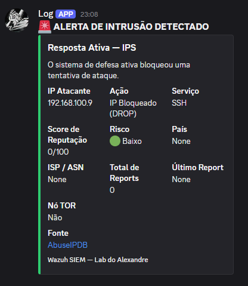

# 🛡️ Wazuh Active Response Lab — Intrusion Prevention System (IPS)


## 📌 Descrição do Projeto

Este projeto demonstra a implementação de uma camada de **Defesa Ativa** utilizando o SIEM Wazuh em um ambiente Ubuntu Server. O objetivo foi configurar o sistema para detectar ataques de força bruta via SSH e automatizar a resposta de mitigação diretamente no firewall (IPtables), com notificação em tempo real via Discord.

O lab simula um cenário realista de SOC Tier 1, onde o analista não precisa intervir manualmente para conter ataques volumétricos de credencial — o próprio pipeline de detecção e resposta atua de forma autônoma, reduzindo o MTTD (Mean Time to Detect) e o MTTR (Mean Time to Respond).

---

## 🗺️ Arquitetura do Lab

```
┌─────────────────────┐       SSH Brute Force        ┌─────────────────────┐
│   Máquina Atacante  │ ─────────────────────────►   │  Ubuntu Server      │
│   192.168.100.9     │                              │  (Wazuh Agent)      │
└─────────────────────┘                              └────────┬────────────┘
                                                              │ Logs /var/log/auth.log
                                                              ▼
                                                   ┌─────────────────────┐
                                                   │   Wazuh Manager     │
                                                   │ Análise + Correlação│
                                                   └────────┬────────────┘
                                          ┌─────────────────┼──────────────────┐
                                          ▼                 ▼                  ▼
                               ┌──────────────────┐  ┌───────────┐  ┌──────────────────┐
                               │ Active Response  │  │  Alerta   │  │ Discord Webhook  │
                               │ firewall-drop.sh │  │  Nível 10+│  │ Notificação SOC  │
                               └──────────────────┘  └───────────┘  └──────────────────┘
                                          │
                                          ▼
                               ┌──────────────────┐
                               │IPtables          │
                               │DROP 192.168.100.9│
                               └──────────────────┘
```

---

## 🎯 Mapeamento MITRE ATT&CK

| Tática | Técnica | ID | Descrição |
|---|---|---|---|
| Credential Access | Brute Force | [T1110](https://attack.mitre.org/techniques/T1110/) | Tentativas repetidas de login via SSH |
| Defense Evasion | — | — | Mitigado via Active Response automática |

**Controles defensivos implementados:**

- **Detecção**: Correlação de eventos de falha de autenticação (`sshd`) com threshold configurado no Wazuh (nível 10+)
- **Resposta**: Bloqueio automatizado via `firewall-drop` (Active Response) — mapeado para a fase de **Containment** do NIST SP 800-61
- **Notificação**: Alerta em tempo real para canal de operações via Discord Webhook

---

## 🚀 Tecnologias Utilizadas

| Tecnologia | Função |
|------------|--------|
| **Wazuh Manager** | Motor de análise, correlação de eventos e orquestração da resposta ativa |
| **Wazuh Agent** | Coleta e envio de logs do sistema monitorado |
| **IPtables** | Firewall Linux para bloqueio dinâmico de IPs atacantes |
| **Bash** | Scripting para integração com webhook do Discord |
| **Ubuntu Server** | Sistema operacional do ambiente alvo |
| **Discord Webhook** | Canal de notificação e alertas do SOC (ChatOps) |

---

## ⚙️ Implementação Técnica

### Configuração do Active Response (`ossec.conf`)

A resposta ativa foi configurada com três parâmetros principais:

**1. Command** — define o script de mitigação a ser executado:
```xml
<command>
  <name>firewall-drop</name>
  <executable>firewall-drop</executable>
  <timeout_allowed>yes</timeout_allowed>
</command>
```

**2. Active Response** — define o gatilho de execução:
```xml
<active-response>
  <command>firewall-drop</command>
  <location>local</location>
  <rules_group>authentication_failures</rules_group>
  <level>10</level>
  <timeout>600</timeout>
</active-response>
```

**Por que nível 10?**

O Wazuh classifica eventos em uma escala de 0 a 15. Níveis abaixo de 10 podem representar falhas isoladas de login (ex: usuário que esqueceu a senha), enquanto o nível 10 indica uma quantidade relevante de tentativas em um curto período — padrão característico de brute force automatizado. Usar um threshold muito baixo (ex: nível 7) aumentaria o risco de falsos positivos e poderia bloquear administradores legítimos.

**3. Timeout** — o IP permanece bloqueado por 600 segundos (10 minutos), tempo suficiente para interromper o ataque sem bloquear permanentemente um IP que poderia ser legítimo.

---

## 🤖 Integração ChatOps — Discord Webhook

Para aproximar o lab de um ambiente de SOC real, implementei uma integração via Webhook com o Discord, permitindo que alertas sejam entregues ao canal da equipe de segurança em tempo real.

**Fluxo de execução:**

1. O Wazuh Manager detecta o evento e dispara o Active Response
2. O script `discord-notifier.sh` é executado em paralelo ao bloqueio
3. O script realiza parsing do JSON do alerta para extrair `srcip`, `rule.description` e timestamp
4. Uma mensagem formatada é enviada ao canal do Discord via HTTP POST

**Arquivo:** `scripts/discord-notifier.sh`

**Exemplo de alerta recebido:**



---

## 📊 Prova de Conceito (PoC)

Durante o teste, o sistema identificou o IP `192.168.100.9` realizando múltiplas tentativas de login inválido via SSH.

**Log de resposta ativa:**

```
2026/04/19 14:32:11 active-response/bin/firewall-drop: Starting
2026/04/19 14:32:11 active-response/bin/firewall-drop: Blocking IP 192.168.100.9
2026/04/19 14:32:11 active-response/bin/firewall-drop: Ended
```

**Regra inserida dinamicamente no IPtables:**

```
Chain INPUT (policy ACCEPT)
target     prot opt source               destination
DROP       all  --  192.168.100.9        0.0.0.0/0
```

Após 600 segundos, o Wazuh removeu automaticamente a regra de bloqueio, restaurando o estado original do firewall.

---

## ⚠️ Limitações e Considerações Operacionais

### Falsos positivos

O principal risco desta configuração é o bloqueio acidental de um administrador legítimo que erre a senha repetidamente. Para ambientes de produção, as mitigações recomendadas seriam:

- **Whitelist de IPs confiáveis**: O Wazuh permite configurar uma lista de IPs que nunca sofrerão Active Response, protegendo estações de administração.
- **Ajuste de threshold por horário**: Regras mais permissivas em horário comercial e mais agressivas fora do expediente.
- **Integração com autenticação por chave SSH**: Elimina o vetor de brute force de senha por completo, tornando o ataque inviável.

### Limitações do ambiente de lab

- O ambiente utiliza IPs privados (192.168.x.x), não refletindo a complexidade de redes com NAT ou proxies corporativos
- O bloqueio via IPtables é temporário e stateless — em produção, soluções como Fail2ban com persistência ou firewalls gerenciados centralmente seriam mais adequados

---

## 📁 Estrutura do Repositório

```
wazuh-active-response-ips/
├── configs/
│   └── ossec.conf          # Configuração do Active Response no Wazuh Manager
├── scripts/
│   └── discord-notifier.sh # Script Bash para notificação via Discord Webhook
├── evidence/               # Logs e capturas de tela da PoC
├── img/
│   └── alerta-discord.png  # Print do alerta recebido no Discord
└── README.md
```

---

## 🔭 Próximos Passos

- [ ] Integrar com **TheHive** para abertura automática de casos a cada bloqueio
- [ ] Adicionar enriquecimento de IP com **AbuseIPDB** (reputação do atacante)
- [ ] Criar dashboard no **Kibana** para visualização dos bloqueios ao longo do tempo
- [ ] Implementar whitelist dinâmica via script para proteger IPs administrativos

---

## 📚 Referências

- [Wazuh Active Response Documentation](https://documentation.wazuh.com/current/user-manual/capabilities/active-response/)
- [MITRE ATT&CK — T1110.001: Password Guessing](https://attack.mitre.org/techniques/T1110/001/)
- [NIST SP 800-61 Rev. 2 — Computer Security Incident Handling Guide](https://nvlpubs.nist.gov/nistpubs/SpecialPublications/NIST.SP.800-61r2.pdf)

---

*Projeto desenvolvido para fins de estudo em Segurança Defensiva e Operações de SOC.*
